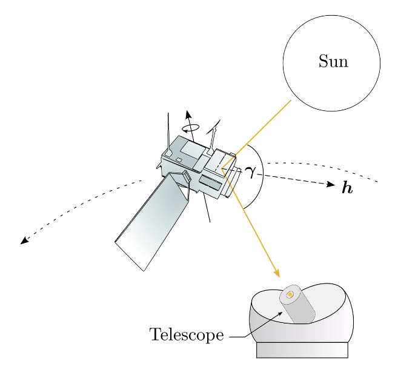

# Section

## Pandoc command

Theme is saved in: __pandoc/themes__

Run the command
```bash
pandoc -t beamer -o output.pdf "beamer-presentation.md" 
       --pdf-engine=xelatex
```

# Motivation


## TEST


adnie


## Space debris


![[debris_stats.png|300]]

[^1]: ESA reference


---

## Light Curves


::: {.columns .onlytextwidth}

::: {.column width=70% height=90%}
- The light curve is a sequence of apparent magnitude measurements in time.
- Light curve combination of its shape, reflection properties.[^a3]
- Observation conditions, or highvariability of the signal 
- A rotator is an object rotatin aroung a presumably fixed axis.[^ahoj]
:::

::: {.column width=30% height=90%}

 
:::
:::

[^ahoj]: Ahoj note
[^a3]: Another ONE ----


---

## Frame / Slide

- list 1
- list 2


## Second Frame

* _italic_
* __bold__


# Another one


## Another slide


::: {.columns align=top .onlytextwidth}

::: {.column widht=30%}
Text in the first column
:::

::: {.column width=60%}
second column

- 1
- 2
- 3[^4]

:::
:::

[^4]: TEsting reference in the footer


---

Next slide with no title

## Footnote

Some random footnote[^2]


[^2]: Some footnote text


---

:::{.centering align=center}
\Huge \textbf{Thank you for your attention!}
:::

---

## Tabulka pre Joza


| **A** | **B** | **C** |
|-------|-------|-------|
| 1     | 2     | 3     |
| 4     | 5     | 6     |
| 7     | 8     | 9     |

